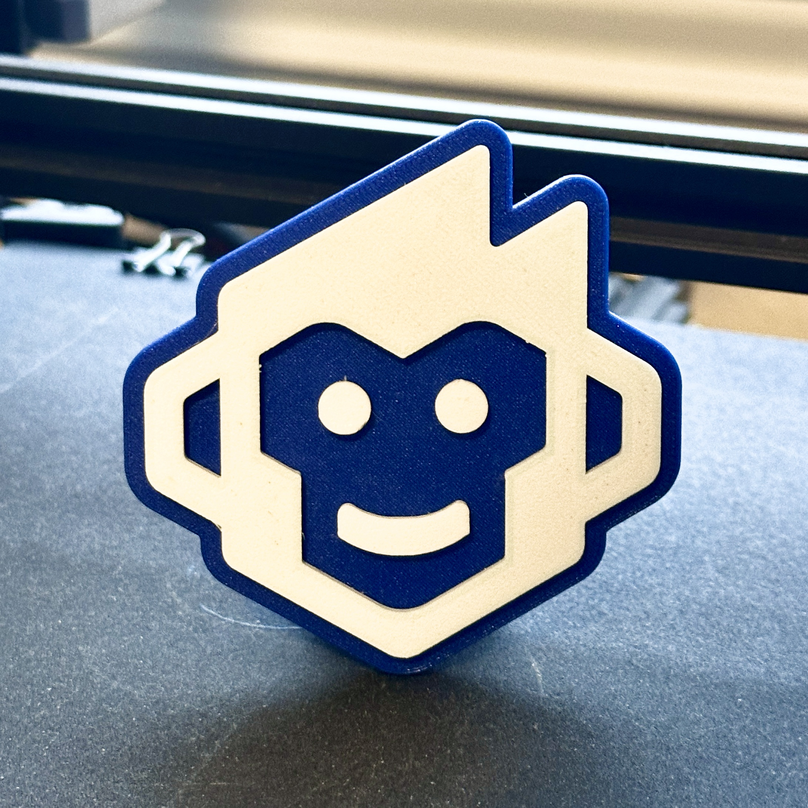

# Shopmonkey 3D Logo

Use the STL file to 3D print a desktop Shopmonkey companion; the dimensions are approximately 3" x 3".

The `Stand` is optional; without the stand, the logo can lay flat, or you can use the cutout on the back of the `Base` to attach a 3M Command Strip-style adhesive.

### Colors

It is recommended to print the `Base` in blue and the `Face` in white; the optional `Stand` should also be in blue.

### Assembly

Add a drop of CA glue in the `Base` slots for the eyes, mouth, and face attachment points, and then drop the `Face` pieces into place. The optional stand snaps into place.
